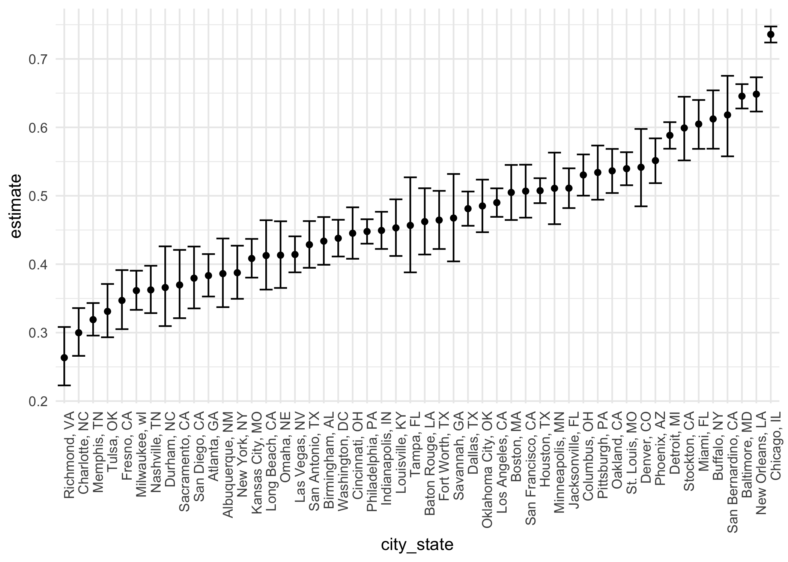
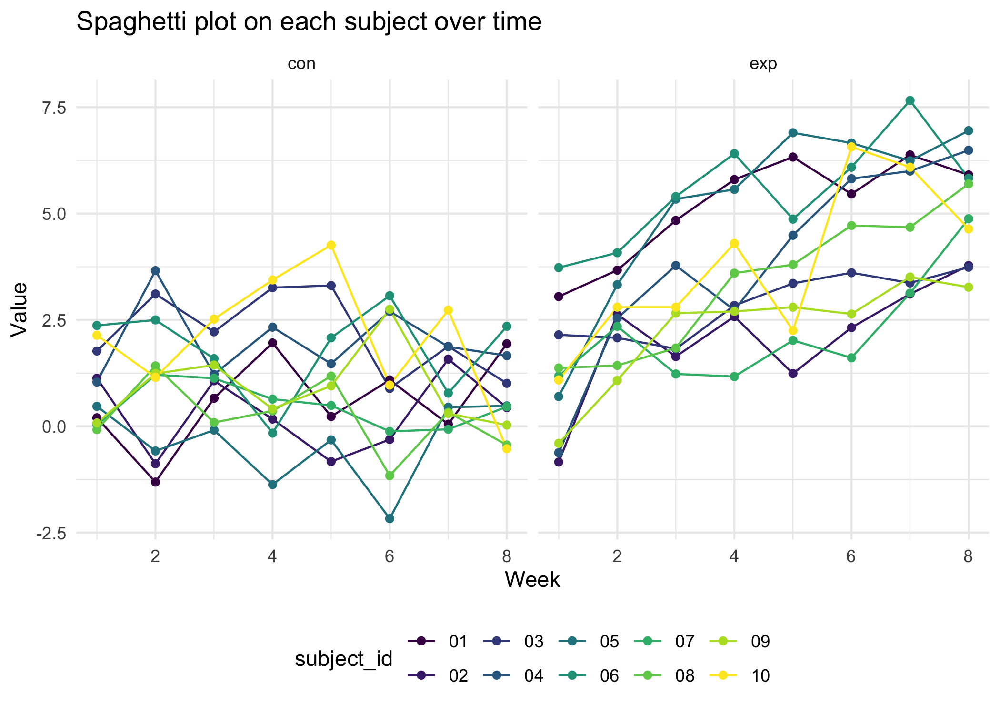
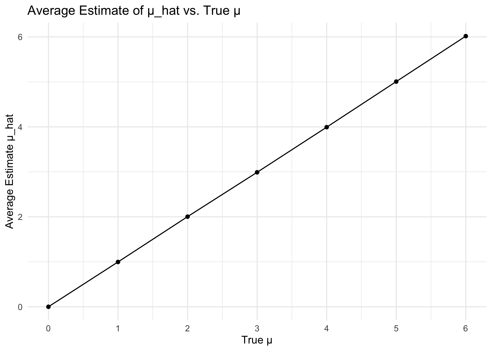

p8105_hw5_yh3676
================
Yuzhe Hu
2023-11-15

## Problem 1

For this problem, we are interested in data gathered and made public by
*The Washington Post* on homicides in 50 large U.S. cities. The code
chunk below imports and cleans the data.

``` r
homicide_df = 
  read_csv("./data/homicide-data.csv", na = c("", "NA", "Unknown")) %>%
  mutate(
    city_state = str_c(city, state, sep = ", "),
    resolution = case_when(
      disposition == "Closed without arrest" ~ "unsolved",
      disposition == "Open/No arrest"        ~ "unsolved",
      disposition == "Closed by arrest"      ~ "solved"
    )
  ) %>% 
  filter(city_state != "Tulsa, AL") 
```

    ## Rows: 52179 Columns: 12
    ## ── Column specification ────────────────────────────────────────────────────────
    ## Delimiter: ","
    ## chr (8): uid, victim_last, victim_first, victim_race, victim_sex, city, stat...
    ## dbl (4): reported_date, victim_age, lat, lon
    ## 
    ## ℹ Use `spec()` to retrieve the full column specification for this data.
    ## ℹ Specify the column types or set `show_col_types = FALSE` to quiet this message.

The resulting dataframe has 52178 entries, on variables that include the
victim name, race, age, and sex; the date the homicide was reported; and
the location of the homicide. In cleaning, I created a `city_state`
variable that includes both city and state, and a `resolution` variable
to indicate whether the case was closed by arrest. I also excluded one
entry in Tulsa, AL, which is not a major US city and is most likely a
data entry error.

In the next code chunk, I group within cities and summarize to produce
the total number of homicides and the number that are solved.

``` r
city_homicide_df = 
  homicide_df %>% 
  select(city_state, disposition, resolution) %>% 
  group_by(city_state) %>% 
  summarize(
    hom_total = n(),
    hom_unsolved = sum(resolution == "unsolved"))
```

Focusing only on Baltimore, MD, I can use the `prop.test` and
`broom::tidy` functions to obtain an estimate and CI of the proportion
of unsolved homicides in that city. The table below shows those values.

``` r
bmore_test = 
  prop.test(
    x = filter(city_homicide_df, city_state == "Baltimore, MD") %>% pull(hom_unsolved),
    n = filter(city_homicide_df, city_state == "Baltimore, MD") %>% pull(hom_total)) 

broom::tidy(bmore_test) %>% 
  knitr::kable(digits = 3)
```

| estimate | statistic | p.value | parameter | conf.low | conf.high | method                                               | alternative |
|---------:|----------:|--------:|----------:|---------:|----------:|:-----------------------------------------------------|:------------|
|    0.646 |   239.011 |       0 |         1 |    0.628 |     0.663 | 1-sample proportions test with continuity correction | two.sided   |

Building on this code, I can use functions in the `purrr` package to
obtain estimates and CIs for the proportion of unsolved homicides in
each city in my dataset. The code below implements this analysis.

``` r
test_results = 
  city_homicide_df %>% 
  mutate(
    prop_tests = map2(hom_unsolved, hom_total, \(x, y) prop.test(x = x, n = y)),
    tidy_tests = map(prop_tests, broom::tidy)) %>% 
  select(-prop_tests) %>% 
  unnest(tidy_tests) %>% 
  select(city_state, estimate, conf.low, conf.high) %>% 
  mutate(city_state = fct_reorder(city_state, estimate))
```

Finally, I make a plot showing the estimate (and CI) of the proportion
of unsolved homicides in each city.

``` r
test_results %>% 
  mutate(city_state = fct_reorder(city_state, estimate)) %>% 
  ggplot(aes(x = city_state, y = estimate)) + 
  geom_point() + 
  geom_errorbar(aes(ymin = conf.low, ymax = conf.high)) + 
  theme(axis.text.x = element_text(angle = 90, hjust = 1))
```



This figure suggests a very wide range in the rate at which homicides
are solved – Chicago is noticeably high and, given the narrowness of the
CI, likely is the location of many homicides.

## Problem 2

Create a tidy dataframe containing data from all participants.

``` r
# read all dataframes
combined_df = 
  tibble(
    files = list.files("./data/problem2/"),
    path = str_c("./data/problem2/", files)
  ) |>
  mutate(data = map(path, read_csv)) |>
  unnest()

# tidy the result
tidy_df = 
  combined_df |>
  mutate(
    files = str_replace(files, ".csv", ""),
    arm = str_sub(files, 1, 3),
    subject_id = str_sub(files, 5, 7)) |>
  pivot_longer(
    week_1:week_8,
    names_to = "week",
    values_to = "value",
    names_prefix = "week_") |>
  mutate(week = as.numeric(week)) |>
  select(arm, subject_id, week, value)
```

Make a spaghetti plot showing observations on each subject over time.

``` r
tidy_df |>
  ggplot(aes(x = week, y = value, color = subject_id)) +
  geom_line() +
  geom_point() + 
  facet_grid(~arm) +
  labs(x = 'Week', y = 'Value', title = 'Spaghetti plot on each subject over time')
```



- From the spaghetti plot, the values of the 10 participants in the
  experimental arm has an increasing trend over 8 weeks. In contrast,
  the values of the 10 participants in the control arm do not have this
  trend.

## Problem 3

Simulate for `μ = 0`

``` r
t_test = function(mu){
  sim_data = tibble(
    rnorm(n = 30, mean = mu, sd = 5)) 
  
  t_test_result = 
    t.test(sim_data) |>
    broom::tidy() |>
    select(estimate, p.value)
  
  return(t_test_result)
}
  
mu_0 =
  tibble(
    mu = 0,
    iteration = 1:5000
  ) |>
  mutate(t_test_df = map(mu, t_test)) |>
  unnest(t_test_df)
```

Simulate for `μ={1,2,3,4,5,6}`

``` r
multimu_result =
  expand_grid(mu = 1:6, iteration = 1:5000) |>
  mutate(multimu_df = map(mu, t_test)) |>
  unnest(multimu_df)
```

A plot showing the proportion of times the null was rejected.

``` r
result = bind_rows(mu_0, multimu_result)
result |>
  group_by(mu) |>
  summarize(proportion_rejected = sum(p.value < 0.05)/5000) |>
  ggplot(aes(x = mu, y = proportion_rejected)) +
  scale_x_continuous(limits = c(0, 6), breaks = seq(0, 6, 1)) + 
  geom_point() + 
  geom_line() +
  labs(x = "True μ ", y = "Power of the Test", title = "Power of t-test vs. Different μ ")
```


- From the plot, it can be seen that power increases as the effect size
  increases.

A plot showing the average estimate of `μ_hat`.

``` r
result |>
  group_by(mu) |>
  summarize(average_estimate = mean(estimate)) |>
  ggplot(aes(x = mu, y = average_estimate)) +
  scale_x_continuous(limits = c(0, 6), breaks = seq(0, 6, 1)) + 
  geom_point() + 
  geom_line() +
  labs(x = "True μ", y = "Average Estimate μ_hat", title = "Average Estimate of μ_hat vs. True μ")
```



A plot showing the average estimate of `μ_hat` only in samples for which
the null was rejected.

``` r
rejected_result =
  result |>
  filter(p.value < 0.05) |>
  group_by(mu) |>
  summarize(average_estimate = mean(estimate)) |>
  ungroup()

rejected_result |> 
  ggplot(aes(x = mu, y = average_estimate )) +
  geom_point() + 
  geom_line() +
  scale_x_continuous(limits = c(0, 6), breaks = seq(0, 6, 1)) + 
  labs( x = "True μ", y = "Average Estimate μ_hat (when null was rejected)", title = 
  "Average Estimate μ_hat (when null was rejected) vs. True μ")
```


- The sample average of $\hat{\mu}$ across tests for which the null is
  rejected does not equal to the true value of μ, especially when μ is
  close to null value 0, for example when μ = 1, 2. This is because when
  μ is close to null value 0, the effect size is relative small and the
  power is relative low according to our first graph in problem 3. When
  μ is far larger than 0, the power increases as effect size increases,
  most of the samples will have the null rejected and the average
  estimate will approximately equal to the true value of μ.
